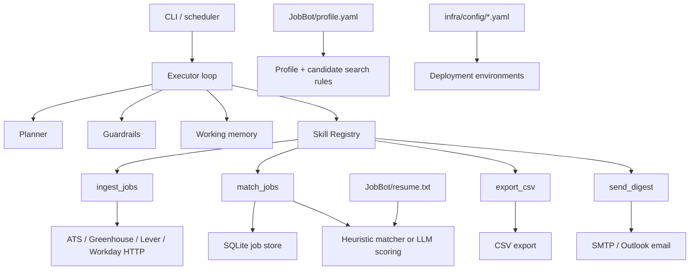

# JobBot project graph

## Components
- `src/agent`: runtime loop, planning, config, state, guardrails, profile, memory.
- `src/skills`: ingest, match, export, digest handlers.
- `src/tools`: HTTP, SQLite, CSV, SMTP adapters.
- `tests`: unit, integration, and evaluator coverage.
- `infra`: Docker and environment configuration.
- `docs`: hosting, memory, infra, and data-handling notes.

## Execution flow
1. Load typed configuration and profile.
2. Run the executor loop with budget checks.
3. Fetch jobs from configured ATS sources.
4. Deduplicate using job hash and exclusion rules.
5. Score and filter matches.
6. Write results to SQLite and CSV.
7. Send one consolidated digest email if enabled.
